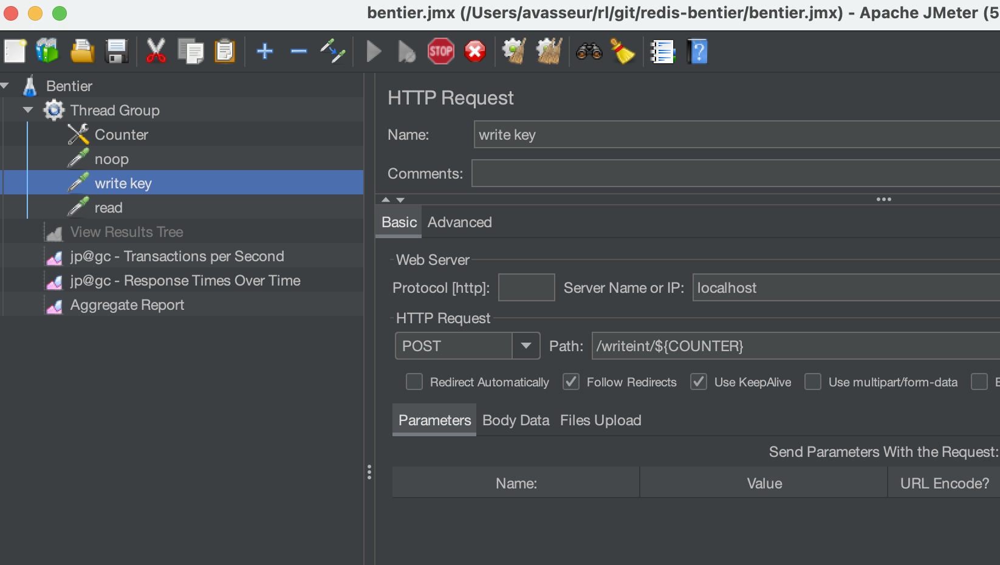

# redis-bentier
Redis simple SpringBoot microservice and instructions for simple JMeter runs

# How to run

## Configuration
Configure `src/main/resources/application.properties` for your Redis configuration.

Read more Spring Boot / Spring Data for connection pool and cluster/sentinel configuration
or in [reference documentation for configuration options](https://docs.spring.io/spring-boot/docs/current/reference/html/application-properties.html#appendix.application-properties.data)

Example
```
spring.data.redis.client-type=jedis
spring.data.redis.jedis.pool.enabled=true
spring.data.redis.jedis.pool.max-active=16
spring.data.redis.jedis.pool.max-idle=16
spring.data.redis.jedis.pool.min-idle=16
spring.data.redis.jedis.pool.max-wait=3000
```

The SpringBoot runtime will use Jetty with a dynamic thread pool that you can also control.
See list of parameters and defaults in the server section at [SpringBoot documentation](https://docs.spring.io/spring-boot/docs/current/reference/html/application-properties.html#appendix.application-properties.server)
Example
```
server.jetty.threads.max=200
```

## Compile and run
You can run locally `./mvnw spring-boot:run` or build an executable jar `./mvnw package` to run with `java -jar ...`and more advanced JVM options.

Redis (ideally Redis Stack) must be up & running before unless you change from default localhost:6379 standalone Redis.


## Redis and HTTP endpoint
The application is very basic with a Redis String model with 'bentier:0000n' keys (n with padding) and a value that is always the same and fixed at 150 bytes (char UTF-8 by default).
See sources for example endpoint:
- /noop does nothing (good to test SpringBoot Jetty runtime)
- /readint/n and /writeint/n to read and write the bentier:0000n key/value
- /load100, /read, /write to read and write generating a random key

# How to benchmark

## Benchmarking with ab
The Apache ab gives a simple & quick way to test it while also using Redis Stack.
Note - as keys are random generated when using /load100 or /write this may write with duplicates.
Use /writeint/n for a more deterministic key sequence.
```
ab -c 100 -n 2000 localhost:8080/load100
ab -c 25 -n 50000 localhost:8080/write
ab -c 25 -n 50000 localhost:8080/read
```

You can try [this link http://localhost:8080/load100](http://localhost:8080/load100])
and explore with [Redis Insight](http://localhost:8001) if you are running with Redis Stack.


## Benchmarking with JMeter

First install JMeter
- Install JMeter (latest tested with JMeter 5.5)
- Add the [JMeter Plugin Manager](https://jmeter-plugins.org/install/Install/)
- Launch JMeter UI (`./apache-jmeter-5.5/bin/jmeter.sh`) and add plugins for *"3 Basic Graphs"*
- Relaunch and open the test plan `bentier.jmx`

Fine tune the test plan
- Review the ThreadGroup and change the size as needed
- Review / disable / enable or adapt the HTTP requests
- By default it relies on using JMeter provided ${COUNTER} monotonic counter - and assumes only one JMeter runner is being used.
- You can use /read and /write endpoint for randomized key (at SpringBoot level)




## Exploring threads and performance with VisualVM

You can use VisualVM to quickly check Heap, Thread, and if any thread is waiting for the pooled connection, or explore thread dumps.


## Exploring Java heap with Using MAT

You can use Eclipse MAT to quickly check Heap dump. Here is the connections from a pool of 8.

